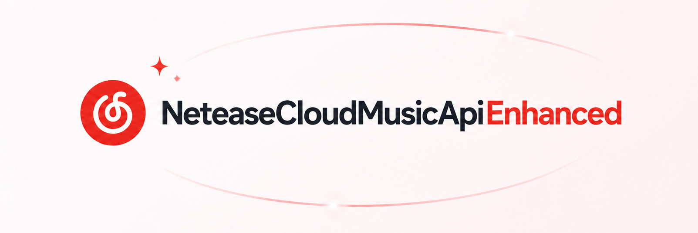

<p align="center">
  
</p>

<p align="center">
  <a href="https://www.npmjs.com/package/@neteasecloudmusicapienhanced/api">
    
  </a>
  <a href="https://www.npmjs.com/package/@neteasecloudmusicapienhanced/api">
    
  </a>
  <a href="https://github.com/NeteaseCloudMusicApiEnhanced/api-enhanced">
    
  </a>
  <a href="https://nodejs.org/">
    
  </a>
  <a href="https://hub.docker.com/r/moefurina/ncm-api">
    
  </a>
  <a href="https://hub.docker.com/r/moefurina/ncm-api">
    
  </a>
  <a href="https://www.typescriptlang.org/">
    
  </a>
</p>


## 项目简介

网易云音乐第三方 Node.js API, 支持丰富的音乐相关接口，适合自建服务、二次开发和多平台部署

> [!IMPORTANT]
>
> ## 注意
>
> - 本项目是自由项目, 不带任何担保, 在基于`MIT License`的许可下, 任何人都可以自由使用、修改和分发本项目的代码, 包括用于商业目的. 
> - 该项目是个合作计划, 有很多人参与了此次贡献, 前往 [Contributors](https://github.com/NeteaseCloudMusicApiEnhanced/api-enhanced/graphs/contributors) 页面查看所有贡献者
> - 原作者项目 [Binaryify/NeteaseCloudMusicApi](https://github.com/binaryify/NeteaseCloudMusicApi) 并非完全停止维护, 你可以在 [NeteaseCloudMusicApi 的 NPMJS 页面](https://www.npmjs.com/package/NeteaseCloudMusicApi) 查看最新版本信息。   
> - 感谢尊重和理解!

## 快速开始

### 环境要求

- Node.js 18 及以上
- 推荐使用 pnpm 进行依赖管理

### 安装

```bash
git clone https://github.com/neteasecloudmusicapienhanced/api-enhanced.git
cd api
pnpm i
```

### 启动服务

```bash
# 默认端口 3000
node app.js

# 指定端口（如 4000）
PORT=4000 node app.js  # Mac/Linux
set PORT=4000 && node app.js  # Windows
```

### 重要提示

- 调用前请务必阅读文档的 [调用前须知](https://neteasecloudmusicapienhanced.js.org/#/?id=%e8%b0%83%e7%94%a8%e5%89%8d%e9%a1%bb%e7%9f%a5) 部分。
- 推荐将敏感信息（如 cookie）通过部署平台的环境变量进行配置。

## 在线体验与文档

- [在线文档](https://neteasecloudmusicapienhanced.js.org/)
- [NPM 包地址](https://www.npmjs.com/package/@neteasecloudmusicapienhanced/api)
- [Dockerhub 主页](https://hub.docker.com/r/moefurina/ncm-api)

## 常见部署方式

- 推荐参考[在线文档](https://neteasecloudmusicapienhanced.js.org/)

## Docker 部署说明

本项目支持通过 Docker 一键部署，无需手动安装 Node.js 或依赖。

> 注意: 在 docker 中运行的时候, 由于使用了 request 来发请求, 所以会检查几个 proxy 相关的环境变量(如下所列), 这些环境变量 会影响到 request 的代理, 详情请参考[request 的文档](https://github.com/request/request#proxies), 如果这些环境变量 指向的代理不可用, 那么就会造成错误, 所以在使用 docker 的时候一定要注意这些环境变量. 不过, 要是你在 query 中加上了 proxy 参数, 那么环境变量会被覆盖, 就会用你通过 proxy 参数提供的代理了.

request 相关的环境变量

1. http_proxy
2. https_proxy
3. HTTP_PROXY
4. HTTPS_PROXY
5. no_proxy
6. NO_PROXY

```shell
docker pull moefurina/ncm-api:latest

docker run -d -p 3000:3000 --name ncm-api moefurina/ncm-api:latest


// 或者
docker run -d -p 3000:3000 moefurina/ncm-api:latest

// 去掉或者设置相关的环境变量

docker run -d -p 3000:3000 --name ncm-api -e http_proxy= -e https_proxy= -e no_proxy= -e HTTP_PROXY= -e HTTPS_PROXY= -e NO_PROXY= moefurina/ncm-api:latest

// 或者
docker run -d -p 3000:3000 -e http_proxy= -e https_proxy= -e no_proxy= -e HTTP_PROXY= -e HTTPS_PROXY= -e NO_PROXY= moefurina/ncm-api:latest
```

> 以下是自行 build docker 镜像方式

```shell
$ git clone https://github.com/NeteaseCloudMusicApiEnhanced/api-enhanced && cd api-enhanced

$ sudo docker build . -t ncm-api

$ sudo docker run -d -p 3000:3000 ncm-api
```

## 3. 环境变量

| 变量名                        | 默认值                                  | 说明                                                 |
|----------------------------|--------------------------------------|----------------------------------------------------|
| **CORS_ALLOW_ORIGIN**      | `*`                                  | 允许跨域请求的域名。可填写单个源，或使用逗号分隔多个源（例如 `https://a.com,https://b.com`）。 |
| **ENABLE_PROXY**           | `false`                              | 是否启用反向代理功能。                                        |
| **PROXY_URL**              | `https://your-proxy-url.com/?proxy=` | 代理服务地址。仅当 `ENABLE_PROXY=true` 时生效。                 |
| **ENABLE_RANDOM_CN_IP**    | `false`                              | 是否默认启用随机中国IP。启用后，所有请求默认使用随机中国IP，除非请求参数 `randomCNIP` 显式关闭。 |
| **ENABLE_GENERAL_UNBLOCK** | `true`                               | 是否启用全局解灰（推荐开启）。开启后所有歌曲都尝试自动解锁。                     |
| **ENABLE_FLAC**            | `true`                               | 是否启用无损音质（FLAC）。                                    |
| **SELECT_MAX_BR**          | `false`                              | 启用无损音质时，是否选择最高码率音质。                                |
| **FOLLOW_SOURCE_ORDER**    | `true`                               | 是否严格按照音源列表顺序进行匹配。                                  |

---

### 4. 更新镜像

更新到最新版本：

```bash
docker pull moefurina/ncm-api:latest
docker stop ncm-api && docker rm ncm-api
docker run -d -p 3000:3000 moefurina/ncm-api:latest
```

## Vercel 一键部署

1. fork 本项目
2. 在 Vercel 官网新建项目，导入 fork 的仓库
3. 直接 Deploy

## 腾讯云 Serverless 部署

1. fork 本项目
2. 在腾讯云 serverless 控制台新建 Web 应用，选择 Express 框架
3. 代码仓库选择 fork 的项目，启动文件填写：
   ```bash
   #!/bin/bash
   export PORT=9000
   /var/lang/node16/bin/node app.js
   ```
4. 完成部署后，访问 API 网关的 URL 即可

## Node.js 方式调用

支持直接在 Node.js 项目中引入和调用，返回 Promise：

```js
const {
  login_cellphone,
  user_cloud,
} = require('@neteasecloudmusicapienhanced/api')
async function main() {
  const result = await login_cellphone({ phone: '手机号', password: '密码' })
  console.log(result)
  const result2 = await user_cloud({ cookie: result.body.cookie })
  console.log(result2.body)
}
main()
```

## TypeScript 支持

```ts
import { banner } from '@neteasecloudmusicapienhanced/api'
banner({ type: 0 }).then((res) => console.log(res))
```

## 单元测试

```bash
pnpm test
```

## 主要功能特性

- 登录/注册/验证码
- 用户信息、歌单、动态、播放记录
- 歌曲、专辑、歌手、MV、歌词、评论、排行榜
- 搜索、推荐、私人 FM、签到、云盘
- 歌曲解锁（解灰）

## 贡献与社区

- 欢迎提交 PR、Issue 参与维护
- 要贡献新接口, 请参考[这篇文章](https://www.focalors.ltd/post/how-to-contribute-ncm-api)

### 致谢

原作者 [Binaryify/NeteaseCloudMusicApi](https://github.com/binaryify/NeteaseCloudMusicApi) 项目为本项目基础 (该项目在`npmjs`网站上仍持续维护, 但 github 仓库已不再更新)

感谢大佬们为逆向eapi, weapi, xeapi等加密算法所做的贡献

项目参考:

[trazyn/ieaseMusic](https://github.com/trazyn/ieaseMusic)

[listen1/listen1_chrome_extension](https://github.com/listen1/listen1_chrome_extension)

[chaunsin/netease-cloud-music](https://github.com/chaunsin/netease-cloud-music)

[folltoshe/netease-report-listen-song](https://github.com/folltoshe/netease-report-listen-song)

### SDK 生态

| 语言     | 作者                                          | 地址                                                                                       | 类型  |
|--------|---------------------------------------------|------------------------------------------------------------------------------------------|-----|
| Java   | [JackuXL](https://github.com/JackuXL)       | [NeteaseCloudMusicApi-SDK](https://github.com/JackuXL/NeteaseCloudMusicApi-SDK)          | 第三方 |
| Java   | [1015770492](https://github.com/1015770492) | [yumbo-music-utils](https://github.com/1015770492/yumbo-music-utils)      | 第三方 |
| Python | [盧瞳](https://github.com/2061360308)         | [NeteaseCloudMusic_PythonSDK](https://github.com/2061360308/NeteaseCloudMusic_PythonSDK) | 第三方 |
| Swift  | [Lincb522](https://github.com/Lincb522)  | [NeteaseCloudMusicApi-Swift](https://github.com/Lincb522/NeteaseCloudMusicAPI-Swift)     | 第三方 |
| Rust   | [SPlayer-Dev](https://github.com/splayer-dev)  | [ncm-api-rs](https://github.com/SPlayer-Dev/ncm-api-rs)     | 第三方 |


### 依赖此项目的优秀开源项目

- [qier2222/YesPlayMusic](https://github.com/qier222/YesPlayMusic)

- [MaigoLabs/amaoke.app](https://github.com/MaigoLabs/amaoke.app)

- [Yueby/music-together](https://github.com/Yueby/music-together)

- [chthollyphlie/folia-major](https://github.com/chthollyphile/folia-major)

## License

[MIT License](https://github.com/MoeFurina/NeteaseCloudMusicApiEnhanced/blob/main/LICENSE)
